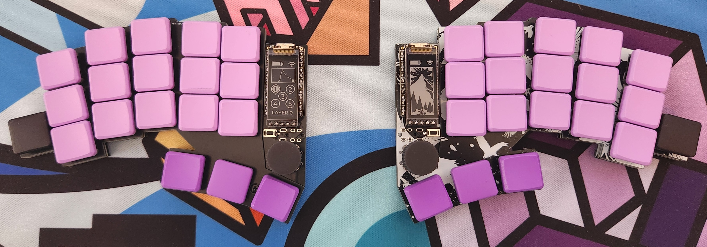
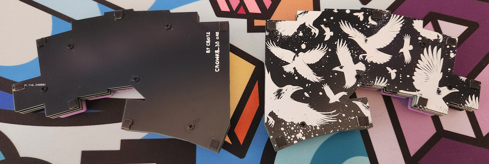

# crowkb keyboards
The crowkb keyboards are split, staggered and splayed keyboard with low placed thumbkeys. I designed them because I felt a lot of the keyboards in this space have an uncomfortable thumb placement for my size of hands.

parts and instructions in docs folder

## crowkb_38

## crowkb_46

