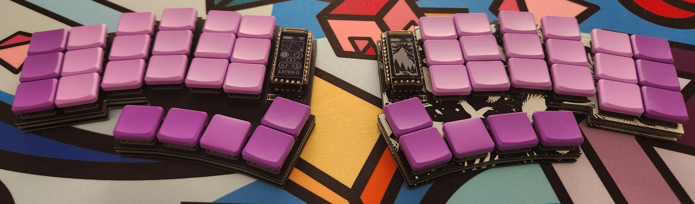
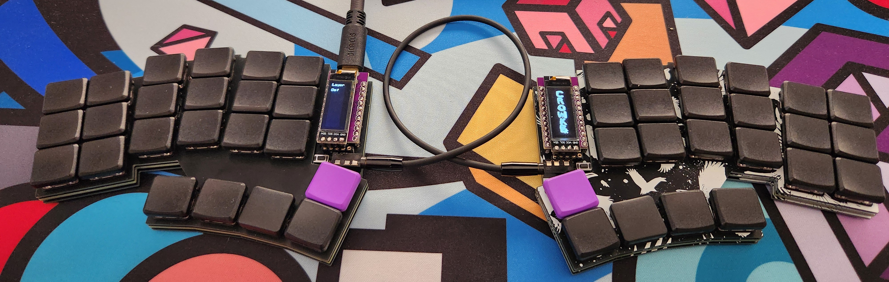

# crowkb keyboard
The crowkb is a split 3x6 staggered and splayed keyboard with 5 low placed thumbkeys. I designed it because I felt a lot of the keyboards in this space have an uncomfortable thumb placement for my size of hands.

parts and instructions in docs folder

## images

